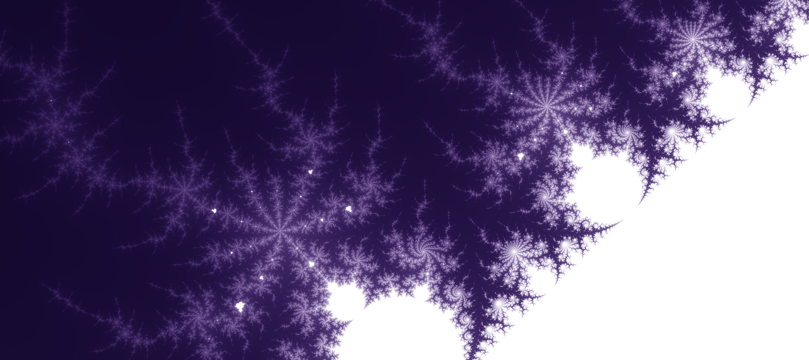

# Simple multi-threaded mandelbrot renderer


## Dependencies
- [png++](http://savannah.nongnu.org/projects/pngpp/)
- [GNU C Library](https://sourceware.org/glibc/)

For Debian/Ubuntu Linux, these can be installed with:
`sudo apt install libpng++-dev libc-dev`

The makefile assumes that you are using [GCC](https://gcc.gnu.org/):
`sudo apt install gcc`

## Build
Make sure that you have a version of [GCC](https://gcc.gnu.org/) capable of compiling C++17 installed and that `g++` is in your $PATH.
```shell
cd path/to/source/directory
make all -B
```
The executable will be at `bin/mandelbrot`.

## Usage
```
Usage: mandelbrot [OPTION]...

Render an image of the mandelbrot set.
  -x, --width                  The width of the image in pixels.
  -y, --height                 The height of the image in pixels.
  -r, --real                   The real component of the coordinate
                               at the centre of the image.

  -r, --imaginary              The imaginary component of the
                               coordinate at the centre of the image.

  -m, --max_iterations         The maximum number of iterations to test
                               a pixel for.

  -e, --escape_radius          The modulus/magnitude/norm beyond which
                               iteration will stop.

  -s, --scale                  The reciprocal of the width of the
                               image on the complex plane.

  -a, --angle                  The angle of the image in degrees.
  -o, --ouput                  The output directory.
  -h, --help                   Display this help text.

All numerical arguments take floating point numbers except for
--width, --height, and --max_iterations, which only take integers.
```